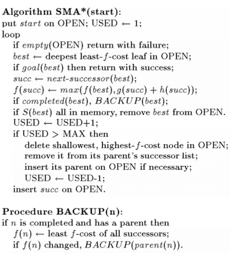
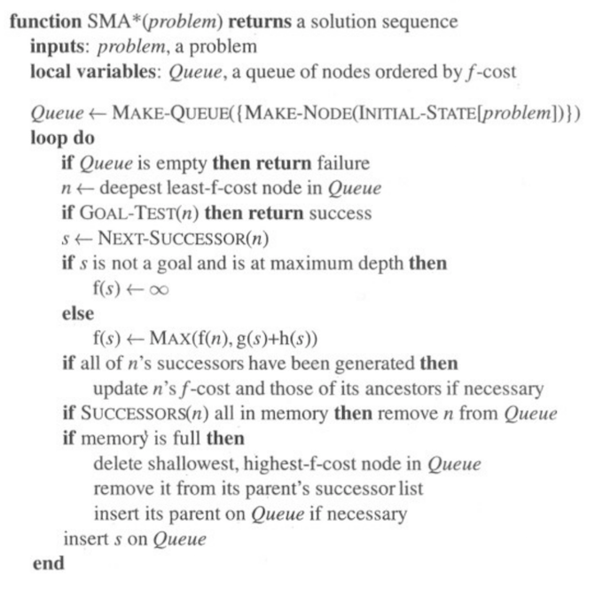

# SMA* Pseudo

## Wikipedia

~~~
function SMA-star(problem): path
  queue: set of nodes, ordered by f-cost;
begin
  queue.insert(problem.root-node);

  while True do begin
    if queue.empty() then return failure; 
    //there is no solution that fits in the given memory
    node := queue.begin(); // min-f-cost-node
    if problem.is-goal(node) then return success;
    
    s := next-successor(node)
    if !problem.is-goal(s) && depth(s) == max_depth then
        f(s) := inf; 
        // there is no memory left to go past s, 
        // so the entire path is useless
    else
        f(s) := max(f(node), g(s) + h(s));
        // f-value of the successor is the maximum of
        //  f-value of the parent and 
        // heuristic of the successor + path length to the successor
    endif
    if no more successors then
       update f-cost of node and those of its ancestors if needed
    
    if node.successors ⊆ queue then queue.remove(node); 
    // all children have already been added to the queue 
    // via a shorter way
    if memory is full then begin
      badNode := shallowest node with highest f-cost;
      for parent in badNode.parents do begin
        parent.successors.remove(badNode);
        if needed then queue.insert(parent); 
      endfor
    endif

    queue.insert(s);
  endwhile
end
~~~

## https://cis.temple.edu/

~~~
function SMA*(problem) returns a solution sequence
   Queue, a queue of nodes ordered by f-cost
       {Queue is a static local variable}
{  Queue <-- MAKE-QUEUE(MAKE-NODE(INITIAL-STATE[problem]))
   loop {
      if Queue is empty then return failure
      n <-- deepest least f-cost node in Queue
      if GOAL-TEST(n) then return success
      s <-- NEXT-SUCCESSOR(n)
      if s is not a goal and is at maximum depth then 
         f(s) <-- INFINITY
      else
         f(s) <-- MIN(f(n),g(s)+h(s))
      if all of n's successors have been generated then
         update n's f-cost and those of its ancestors if necessary
      if SUCCESSORS(n) all in memory then remove n from Queue
      if memory is full then
        {delete shallowest, highest f-cost node in Queue
         remove it from its parent's successor list
         insert its parent on Queue if necessary}
      insert s in Queue}}
~~~

## Efficient memory-bounded search methods S.Russel

## Norgiv 1st edition

