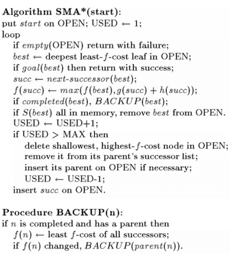
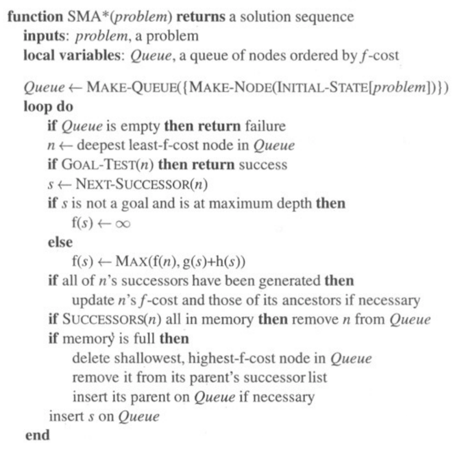

# SMA* Pseudo

## Wikipedia

~~~
function SMA-star(problem): path
  queue: set of nodes, ordered by f-cost;
begin
  queue.insert(problem.root-node);

  while True do begin
    if queue.empty() then return failure; 
    //there is no solution that fits in the given memory
    node := queue.begin(); // min-f-cost-node
    if problem.is-goal(node) then return success;
    
    s := next-successor(node)
    if !problem.is-goal(s) && depth(s) == max_depth then
        f(s) := inf; 
        // there is no memory left to go past s, 
        // so the entire path is useless
    else
        f(s) := max(f(node), g(s) + h(s));
        // f-value of the successor is the maximum of
        //  f-value of the parent and 
        // heuristic of the successor + path length to the successor
    endif
    if no more successors then
       update f-cost of node and those of its ancestors if needed
    
    if node.successors ⊆ queue then queue.remove(node); 
    // all children have already been added to the queue 
    // via a shorter way
    if memory is full then begin
      badNode := shallowest node with highest f-cost;
      for parent in badNode.parents do begin
        parent.successors.remove(badNode);
        if needed then queue.insert(parent); 
      endfor
    endif

    queue.insert(s);
  endwhile
end
~~~

## https://cis.temple.edu/

~~~
function SMA*(problem) returns a solution sequence
   Queue, a queue of nodes ordered by f-cost
       {Queue is a static local variable}
{  Queue <-- MAKE-QUEUE(MAKE-NODE(INITIAL-STATE[problem]))
   loop {
      if Queue is empty then return failure
      n <-- deepest least f-cost node in Queue
      if GOAL-TEST(n) then return success
      s <-- NEXT-SUCCESSOR(n)
      if s is not a goal and is at maximum depth then 
         f(s) <-- INFINITY
      else
         f(s) <-- MIN(f(n),g(s)+h(s))
      if all of n's successors have been generated then
         update n's f-cost and those of its ancestors if necessary
      if SUCCESSORS(n) all in memory then remove n from Queue
      if memory is full then
        {delete shallowest, highest f-cost node in Queue
         remove it from its parent's successor list
         insert its parent on Queue if necessary}
      insert s in Queue}}
~~~

## Efficient memory-bounded search methods S.Russel

## Norgiv 1st edition

## Norvig Lisp

~~~lisp

;;; sma.lisp
;;; Currently contains definition for a version of SMA* that operates on
;;; search trees (i.e., no repeated-state checking).
;;; [[Need to update to eliminate looping when memory is too small
;;; and to signal suboptimal solutions when appropriate.]]
;;; Although the basic algorithm is quite simple, the bookkeeping is not.

(defun tree-sma (problem &optional (memory-size 20)
			 &aux n
			      (start (create-start-node problem))
			      (q (make-search-tree start (node-f-cost start)))
			      (memory-used 1))

  (loop 
   (when (empty-tree q) (return nil))
   (setq n (deepest-least-leaf q))
   (when (goal-test problem n)
     (return n))
   (when (= (node-f-cost n) infinity) (return nil))
   (let ((s (tree-get-next-successor n q memory-size problem)))
     (when s
       (unless (node-unexpanded n)  ;;; n exhausted, drop from queue
	 (delete-element n q (node-f-cost n)))
       (incf memory-used)
       (insert-element s q (node-f-cost s))
       (when (> memory-used memory-size)
	 (tree-prune-open q)
	 (decf memory-used)))))
  )

;;; tree-get-next-successor returns the next successor of n, if any (else nil)
(defun tree-get-next-successor (n q memory-size problem &aux (next nil))
  (unless (node-expanded? n) 
    (setf (node-unexpanded n)
	  (if  (= (1+ (node-depth n)) memory-size)
	      (list 'done)
	    (nconc (expand n problem) (list 'done))))
    (setf (node-expanded? n) t))
  (unless (eq (car (node-unexpanded n)) 'done)
    (setq next (pop (node-unexpanded n)))
    (push next (node-successors n)))
  (unless (node-completed? n)
    (when (eq (car (node-unexpanded n)) 'done)  ;;; all successors examined 
      (pop (node-unexpanded n))
      (setf (node-completed? n) t)
      (tree-backup-f-cost n q t)))
  next)

;;; tree-backup-f-cost updates the f-cost for a node's ancestors as needed
(defun tree-backup-f-cost (node q &optional (was-open? nil) 
                                  &aux (current (node-f-cost node))
				       (least infinity)) 
  (when (node-completed? node)
    (dolist (s (node-successors node))
      (let ((v (node-f-cost s)))
        (when (< v least) (setq least v))))
    (dolist (s (node-unexpanded node))
      (let ((v (node-f-cost s)))
        (when (< v least) (setq least v))))
    (when (> least current)
      (when (or was-open? (openp node))  ;;; changing f value - re-order
        (delete-element node q current)
        (insert-element node q least))
      (setf (node-f-cost node) least)
      (let ((parent (node-parent node)))
        (when parent (tree-backup-f-cost parent q))))))

;;; tree-prune-open removes the worst node from the open list.
;;; The node is discarded from the open list, and its successors are
;;; dumped to recycle memory. If the parent was closed, it must be
;;; re-opened, with an updated f-cost (no need to do this until now
;;; because it wasn't on the open list anyway). Closed parent or not,
;;; the worstnode becomes an unexpanded successor of the parent. 

(defun tree-prune-open (q &aux (worstnode (shallowest-largest-leaf q))
                               (parent (node-parent worstnode)))
  (delete-element worstnode q (node-f-cost worstnode))
  (setf (node-successors worstnode) nil) ;;;actually free up memory
  (setf (node-expanded? worstnode) nil)

  (unless (node-unexpanded parent)   ;;;parent was closed - need to re-open
    (insert-element parent q (node-f-cost parent)))
  (tree-unexpand-successor worstnode parent))

(defun tree-unexpand-successor (successor parent)  
  (setf (node-unexpanded parent) 
	(nconc (node-unexpanded parent) (list successor)))
  (setf (node-successors parent)
	(delete successor (node-successors parent) :test #'eq)) 
  (when (node-completed? parent)
    (unless (node-successors parent)
      (setf (node-unexpanded parent) nil) ;;; reclaim space
      (setf (node-expanded? parent) nil)
      (setf (node-completed? parent) nil))))

(defun deepest-least-leaf (q)
  (the-biggest #'(lambda (n) (node-depth n)) (search-tree-node-value
					       (leftmost q)))) 

(defun shallowest-largest-leaf (q)
  (the-smallest-that 
    #'(lambda (n) (node-depth n))
    #'leafp
    (search-tree-node-value (rightmost q))))

(defun find-leaf (node &aux (s (node-successors node)))
  (if s (find-leaf (car s))
      node))

(defun leafp (n)
  (null (node-successors n)))

(defun openp (n)
  (or (not (node-expanded? n))
      (node-unexpanded n)))

~~~

## http://waprogramming.com/papers/50af7709377c22.88356189.pdf

~~~

function SMA-star(problem): path
 queue: set of nodes, ordered by f-cost;
begin
 queue.insert(problem.root-node);

 while True do begin
 if queue.empty() then return failure;
 node := queue.begin(); // min-f-cost-node
 if problem.is-goal(node) then return success;

 s := next-successor(node)
 f(s) := max(f(node), g(s) + h(s))
 if no more successors then
 update node-s f-cost and those of its ancestors if needed

 if node.successors ⊆ queue then queue.remove(node);
 if memory is full then begin
 badNode := queue.popEnd(); // removes node with highest f-cost out of queue
 for parent in badNode.parents do begin
 parent.successors.remove(badNode);
 if needed then queue.insert(parent);
 end;
 end;

 queue.insert(s);
 end;
end; 

~~~

## Mine 1

~~~c
sma_star(src, dst)
    // Init the open list with src
    open = []
    open.append(src)
    // We have used 1 space in memory 
    used = 1
    
    while True
        // Sort open by f-cost and negative depth
        // i.e most deep lowest f-cost node first
        open = sorted(open, lambda x: (x.f, -x.depth))
        // We couldn't find a solution
        if isempty(open)
            return FAIL
        // Get the best current option
        node = open[0]
        // Exit if we have found the goal
        if goal_test(node, dst)
            return FOUND
        // Add the successor to succ list in node and get it
        succ = node.get_next_successor()
        // Set the parent
        succ.parent = node
        // If we are at the max depth, give up it's useless
        if !goal_test(succ) && used == MAX_MEM
            succ.f = INFINITY
        else // Calculate the f-cost
            // f-cost will be the parents f-cost OR
            // g + h, which ever is bigger.
            // This is the pathmax optimisation
            succ.f = max(node.f, succ.g + succ.h)
        // Backup if we have fully searched all successors
        if !node.more_successors()
            backup(node)
        // If we have all successors in memory
        // then forget about the "parent".
        if issubset(node.get_successors(), open)
            delete open[0]
        // Increment our memory usage
        used += 1
        // If we have filled the memory
        if used > MAX_MEM
            // Grab the worst option
            n = open[-1]
            // Remove it
            delete open[-1]
            // Remove it from it's parents successors
            n.parent.cleanup_successor(n)
            // 
            if parent_not_in_open_list
                open.append(n.parent)
            // Open up a space
            used -= 1
        // Add the successor to the open list
        open.append(succ)
END sma_star

// Updates the nodes f-cost to the smallest of it's successors
// If that is not the current f-cost, recurse on the parent.
backup(node)
    if node.parent != null
        temp_f = n.f
        n.f = min([s.f for s in successors])
        if temp_f != n.f
            backup(node.parent)
END backup
~~~

## Mine 2

~~~c

~~~
# IDA*

## Wikipedia

~~~c
 node              current node
 g                 the cost to reach current node
 f                 estimated cost of the cheapest path (root..node..goal)
 h(node)           estimated cost of the cheapest path (node..goal)
 cost(node, succ)  step cost function
 is_goal(node)     goal test
 successors(node)  node expanding function, 
    expand nodes ordered by g + h(node)
 
 procedure ida_star(root)
   bound := h(root)
   loop
     t := search(root, 0, bound)
     if t = FOUND then return bound
     if t = ∞ then return NOT_FOUND
     bound := t
   end loop
 end procedure
 
 function search(node, g, bound)
   f := g + h(node)
   if f > bound then return f
   if is_goal(node) then return FOUND
   min := ∞
   for succ in successors(node) do
     t := search(succ, g + cost(node, succ), bound)
     if t = FOUND then return FOUND
     if t < min then min := t
   end for
   return min
 end function
~~~

# RBFS

## AIMA

~~~c
function RECURSIVE-BEST-FIRST-SEARCH(problem) returns a solution, or 
failure
 return RBFS(problem,MAKE-NODE(problem.INITIAL-STATE),∞)

function RBFS(problem,node,f_limit) returns a solution, or failure 
and a new f-cost limit
 if problem.GOAL-TEST(node.STATE) then return SOLUTION(node)
 successors ← []
 for each action in problem.ACTIONS(node.STATE) do
   add CHILD-NODE(problem,node,action) into successors
 if successors is empty then return failure,∞
 for each s in successors do /* update f with value from previous 
 search, if any */
   s.f ← max(s.g + s.h, node.f)
 loop do
   best ← lowest f-value node in successors
   if best.f > f_limit then return failure,best.f
   alternative ← the second-lowest f-value among successors
   result,best.f ← RBFS(problem,best,min(f_limit,alternative))
   if result ≠ failure then return result
~~~

# Mine2

~~~c
Init the queue
Init the source node etc, add to the queue

While the source f-cost is not infinity.
    If the open queue becomes empty, no solution exists.
        return fail
        
    Get the most promising node.

    If we have a goal in the queue, record it's path.

    If there are more successors available that we have not yet seen.
        Get the next successor.
        Set the successors depth to one more than the "parent".

        If this isnt a goal and we're at max depth, 
            set cost to infinity.
        Otherwise set the costs.
            Get the cost from the "parent" to the successor.
            The f-cost equals the heuristic plus the total cost from the root.
            f-cost = max(f-cost, parent.f-cost).

    If no more successors to generate.
        Set the best cost to infinity.
        If best has some successors (i.e not a leaf node)
            Backup the best successors cost as best's new fcost.
            Reset the successor list.

    If we are out of memory.
        Get the worst option and remove it.

    If there was a successor generated.
        If succ is not already in open_, add it.
 
    Sort the open_ list by f-cost and depth, prioritising f-cost.
~~~